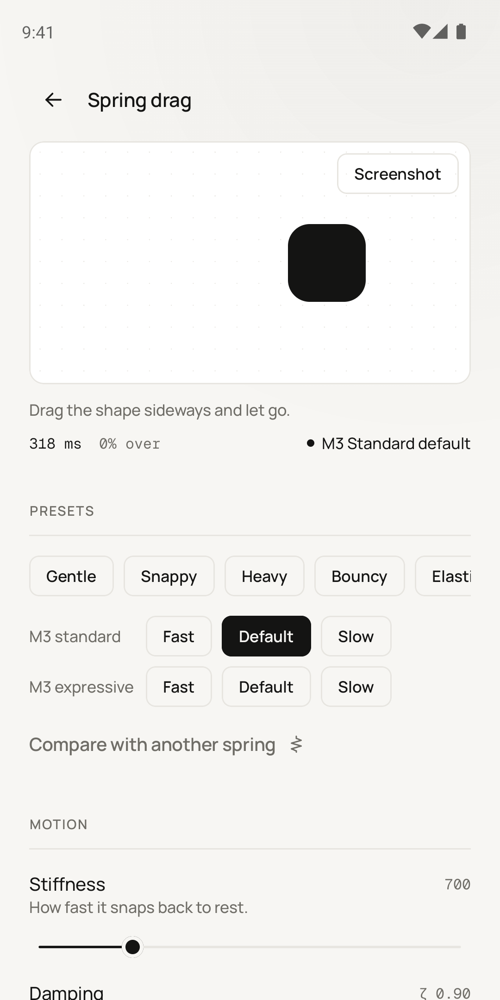
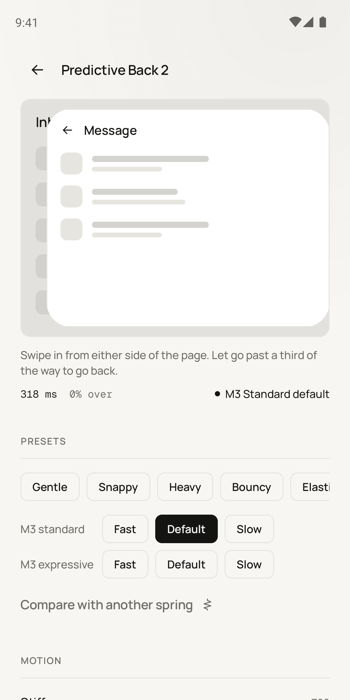
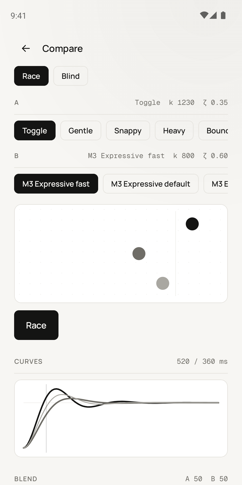

# Hapture

Hapture is an Android app for tuning animations by feel. You drag, flick and tap
real interface elements on your phone, adjust the spring behind them until the
motion feels right, and then take the result with you as working code.

<p>
  
  
  
</p>

## Why it exists

Most animation tools ask you to type numbers. Stiffness 700, damping ratio
0.9, and then you squint at a preview on a laptop screen. That's backwards for
mobile, where motion is mostly felt through your thumb. A bottom sheet that
looks fine in a video can feel sluggish the moment you actually throw it.

Hapture flips that around. The motion is in your hand first. The sliders
still map to real numbers and you can always see them, you just arrive at them
by trying things rather than by guessing.

## What you can do with it

### Thirteen interactions

Spring drag, magnetic snap, swipe and fling, bottom
sheet, pull to refresh, pinch to zoom, predictive back, drag to reorder,
toggle, button press, tab indicator, staggered list and a like burst. Each one
is a real, touchable component driven by a spring you control with two
sliders, plus whatever extra settings that interaction needs (detents for the
sheet, capture radius for the magnet, and so on).

### Presets, and a readout that keeps up

There are eight house presets (Gentle,
Snappy, Bouncy and friends) and the six spatial springs from Material 3's
motion schemes. A small readout under the stage tells you, as you tune, how
long the motion takes to settle, how much it overshoots, and how close it is
to the nearest Material spring.

On a tablet, a foldable or a phone in landscape, the stage and the controls
sit side by side instead.

### Checks that can fix themselves

Every experiment runs through a set of
checks: too slow for a tap response, wobbling too long, overshooting too much
for a small control, stiff enough to jitter on a 60 Hz screen. Most checks come
with a one-tap fix, and you can undo it if you liked it better before.

### Haptics, honestly

Each interaction has a haptic feel (soft, crisp or
firm), and the app tells you honestly whether your phone can play it properly.
Cheaper vibration motors turn everything into the same buzz, and you
shouldn't tune by a feel your phone can't make.

### Capturing a feel you already like

Draw the curve with your finger, sketch
a motion across a mock screen, or point the app at a screen recording of an
animation. It fits a spring to what you showed it.

### Comparing springs

Race them side by side, blend between them with a
slider, or play the blind game where you guess which preset is which. You can
open Compare from any experiment, and it starts with your spring against the
closest Material one.

### Timelines

Timelines chain experiments together with gaps and haptic
markers, and can be exported as a portrait video.

## Getting the motion out

Everything an experiment exports comes from one platform-neutral description
of the motion, so the outputs can't drift apart:

- Jetpack Compose, including the gesture handling for each interaction
  (predictive back exports a ready `PredictiveBackHandler`)
- SwiftUI, Flutter, React Native (Reanimated) and the web (Framer Motion and
  CSS `linear()` easing)
- Lottie, baked from the spring's exact curve
- Figma's custom spring values, plus a plugin in `figma-plugin/` that applies
  them to your prototype
- Design tokens as JSON, Kotlin, Swift, CSS or TypeScript
- Haptic patterns on their own: Android `VibrationEffect`, Core Haptics, AHAP

Every code export includes a reduced-motion version. Code exports also carry a
small stamp, so if you paste the code back into the app later it can tell you
whether someone edited it or whether your saved spring has changed since.

There's also live sync. Turn it on and the phone serves your current spring on
the local network, with a pairing code. Open the link (or scan the QR code) on
your laptop and the code for every platform updates in the browser as you move
the sliders. The Figma plugin can follow it too.

## Privacy

There's no account, no analytics, no ads and no cloud. Experiments live on the
phone. Live sync is off until you start it, stays on your Wi-Fi, and needs a
pairing code. The full policy is in [store/PRIVACY.md](store/PRIVACY.md).

## Building it

You need JDK 17 and the Android SDK (compile and target SDK 35, minimum SDK 26).
The Gradle wrapper handles the rest.

```bash
./gradlew :app:installDebug              # build and install on a connected phone or emulator
./gradlew :app:testDebugUnitTest         # unit tests (physics, exporters, file formats, ...)
./gradlew :app:connectedDebugAndroidTest # on-device tests: real Room, real Compose, real gestures
./scripts/check-generated-kotlin.sh      # compiles every Kotlin snippet the app can export
```

A note on the on-device tests: with the current test libraries they run on
Android 14 and 15 emulators but not on Android 16 images, which fail inside
the test framework before any app code runs.

Release builds are signed from a `keystore.properties` file in the project root.
It's ignored by git, and the steps for creating one are in
[store/RELEASE.md](store/RELEASE.md).

## How the code is laid out

```
app/src/main/java/com/klynstudios/hapture/
  core/      the physics, the neutral motion spec, checks, capture, haptics, live sync
  data/      Room database, migrations, the .hapture project file format
  export/    code generators for every platform
  feature/   the screens: editors, compare, capture, timelines, doodles, home
  ui/        the design system (tokens, components, icons) and theme
figma-plugin/  the Figma plugin
store/         Play Store listing, privacy policy, release notes and assets
```

The physics and exporters don't depend on Android at all, which is why most of
the logic can be unit tested on a plain JVM. If you work on the editors, keep
one thing in mind: the live preview runs on Compose's own `spring()`, the same
call the exported code makes. There's deliberately no separate simulation for
the preview, because the moment there is one, the preview and the export start
to disagree.

For a full tour of every feature and the database history, see
[APP_OVERVIEW.md](APP_OVERVIEW.md).

## Where it stands

The Android app is close to its first Play Store release. A few things haven't
been verified end to end yet: the generated SwiftUI, Flutter, React Native and
web code is checked for content but hasn't been compiled with those toolchains,
and the Figma plugin hasn't been run inside Figma itself. Video capture works
for a solid-coloured object on a plain background, like most UI mockup
recordings, but it isn't general-purpose tracking.

An iOS version may come later.

## Credits

Made by Klyn Studios. Typeset in
[Manrope](https://github.com/sharanda/manrope) and
[Geist Mono](https://github.com/vercel/geist-font), both under the SIL Open Font
License.
